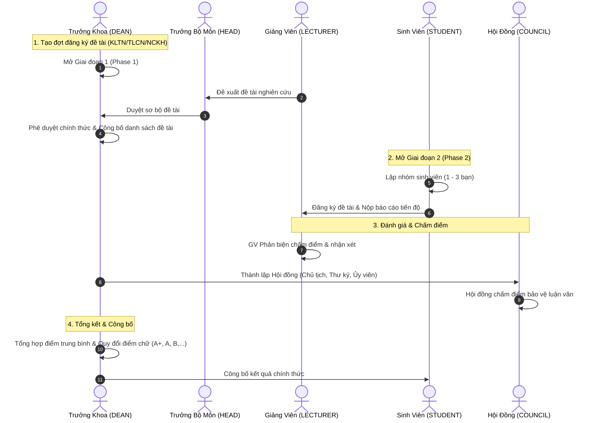

# 🎓 HỆ THỐNG QUẢN LÝ ĐỀ TÀI KHOA CÔNG NGHỆ THÔNG TIN
>
> **Thesis & Course Project Management System REST API**  
> Nền tảng tự động hóa toàn diện quy trình quản lý đề tài: Môn học, Tiểu luận chuyên ngành (TLCN), Nghiên cứu khoa học (NCKH), Khóa luận tốt nghiệp (KLTN).

---

## 📌 MỤC LỤC

1. [Giới thiệu & Tính năng chính](#-giới-thiệu--tính-năng-chính)
2. [Công nghệ sử dụng](#-công-nghệ-sử-dụng)
3. [Yêu cầu môi trường](#-yêu-cầu-môi-trường)
4. [Cấu hình biến môi trường (.env)](#-cấu-hình-biến-môi-trường-env)
5. [Hướng dẫn cài đặt & Khởi chạy](#-hướng-dẫn-cài-đặt--khởi-chạy)
6. [Tài liệu API Swagger UI & CSDL](#-tài-liệu-api-swagger-ui--csdl)
7. [Danh sách tài khoản mẫu](#-danh-sách-tài-khoản-mẫu-đã-khởi-tạo-sẵn)
8. [Quy trình nghiệp vụ & Phân quyền RBAC](#-quy-trình-nghiệp-vụ--phân-quyền-rbac)

---

## 🌟 GIỚI THIỆU & TÍNH NĂNG CHÍNH

Hệ thống được thiết kế theo chuẩn RESTful API với quy trình nghiệp vụ 2 giai đoạn chặt chẽ:

* **Quản lý Đợt đăng ký (Registration Periods):**
  * Thiết lập thời gian riêng cho từng giai đoạn, từng học kỳ, năm học.
  * Trưởng khoa mở/đóng đợt đăng ký và quản lý trạng thái.
* **Quy trình Giai đoạn 1 (Phase 1) - Xây dựng & Phê duyệt đề tài:**
  * Giảng viên đề xuất đề tài (hỗ trợ GVHD chính và GVHD phụ).
  * Trưởng bộ môn phê duyệt sơ bộ đề tài theo chuyên môn.
  * Trưởng khoa phê duyệt chính thức và công bố danh sách đề tài ra toàn khoa.
* **Quy trình Giai đoạn 2 (Phase 2) - Sinh viên đăng ký & Nộp báo cáo:**
  * Sinh viên thành lập nhóm (1 - 3 thành viên, chỉ định Trưởng nhóm).
  * Nhóm sinh viên chọn và đăng ký đề tài từ danh sách đã công bố.
  * Sinh viên nộp báo cáo tiến độ/báo cáo toàn văn kèm link tài liệu.
* **Phân công Giảng viên phản biện (GVPB):**
  * Phân công GVPB cho từng nhóm đề tài (chống xung đột: GVPB không được trùng GVHD).
  * GVPB đánh giá, cho điểm và nhận xét phản biện.
* **Hội đồng chấm đề tài (Defense Council):**
  * Thành lập hội đồng từ 3 đến 5 thành viên (Chủ tịch, Thư ký, Ủy viên).
  * Quy tắc bảo mật học thuật: Giảng viên hướng dẫn không được ngồi trong hội đồng chấm chính đề tài của mình.
* **Tổng hợp Điểm & Công bố kết quả:**
  * Tính điểm trung bình (Trọng số: GVHD + GVPB + Hội đồng).
  * Tự động quy đổi sang thang điểm 4 và điểm chữ (`A+`, `A`, `B+`, `B`, `C+`, `C`, `D+`, `D`, `F`).
  * Trưởng khoa duyệt công bố kết quả chính thức cho sinh viên tra cứu.
* **Bảng tin & Thông báo (Announcements):**
  * Đăng thông báo ghim, đính kèm file, phân quyền xem theo đối tượng.

---

## 💻 CÔNG NGHỆ SỬ DỤNG

* **Backend Core:** Java 17+ (Tương thích hoàn toàn Java 17, 21, 26).
* **Framework:** Spring Boot 3.3.4 (Spring Web, Spring Security 6, Spring Data JPA, Spring Validation).
* **Bảo mật & Phân quyền:** JWT (JSON Web Token - `jjwt 0.12.6`), Role-Based Access Control (`@PreAuthorize`).
* **Cơ sở dữ liệu:**
  * **MySQL 8.x** (Lưu trữ dữ liệu bền vững).
  * **H2 Database** (In-Memory database phục vụ test nhanh).
* **Quản lý biến môi trường:** `me.paulschwarz:spring-dotenv` (Tự động đọc file `.env`).
* **Tài liệu API tương tác:** SpringDoc OpenAPI 3 / Swagger UI 2.6.0.
* **Build Tool:** Gradle 8.x.

---

## 📋 YÊU CẦU MÔI TRƯỜNG

1. **Java Development Kit (JDK):** JDK 17 trở lên (Đã kiểm thử trên OpenJDK 17, 21, 26).
2. **Cơ sở dữ liệu (Tùy chọn):**
   * **MySQL:** Cài đặt sẵn MySQL Server và tạo database `topic_management`.
   * *Hoặc* sử dụng CSDL **H2** tích hợp sẵn không cần cài đặt gì thêm.

---

> **Lưu ý với MySQL:** Hãy tạo trước database bằng lệnh SQL:  
> `CREATE DATABASE topic_management CHARACTER SET utf8mb4 COLLATE utf8mb4_unicode_ci;`

---

## 🚀 HƯỚNG DẪN CÀI ĐẶT & KHỞI CHẠY

### Cách 1: Chạy bằng Terminal / PowerShell (Nhanh nhất)

1. Mở PowerShell hoặc Terminal tại thư mục dự án:

```powershell

# Khởi chạy ứng dụng
.\gradlew.bat bootRun
```

*(Trên Linux/macOS dùng lệnh: `./gradlew bootRun`)*

---

### Cách 2: Chạy bằng IDE (IntelliJ IDEA / VS Code / Eclipse)

* **IntelliJ IDEA:**
  1. Mở thư mục dự án qua menu `File` -> `Open...` chọn thư mục `DALTWEB`.
  2. Đợi Gradle đồng bộ dependencies xong.
  3. Mở file `src/main/java/com/daltweb/topicmanagement/TopicManagementApplication.java` và nhấn nút **Run ▶** (hoặc tổ hợp `Shift + F10`).
* **VS Code:**
  1. Cài đặt extension **Extension Pack for Java** và **Spring Boot Extension Pack**.
  2. Mở file `TopicManagementApplication.java` và chọn **Run Java**.

---

## 🌐 TÀI LIỆU API SWAGGER UI & CSDL

Sau khi khởi động thành công trên cổng `8080`, truy cập:

| Trang quản lý | Địa chỉ URL | Mô tả |
| :--- | :--- | :--- |
| 📖 **Swagger UI (Interactive API)** | [http://localhost:8080/swagger-ui.html](http://localhost:8080/swagger-ui.html) | Xem đầy đủ tài liệu API, tham số, mô hình DTO và test trực tiếp các endpoint |
| 📄 **OpenAPI Spec (JSON)** | [http://localhost:8080/v3/api-docs](http://localhost:8080/v3/api-docs) | File schema JSON chuẩn OpenAPI 3 |
| 🗄️ **H2 Console (Nếu dùng H2)** | [http://localhost:8080/h2-console](http://localhost:8080/h2-console) | JDBC URL: `jdbc:h2:mem:topicdb` \| User: `sa` \| Pass: *(trống)* |

---

## 🔑 DANH SÁCH TÀI KHOẢN MẪU (ĐÃ KHỞI TẠO SẴN)

Hệ thống tự động khởi tạo các tài khoản mẫu khi CSDL trống. Tất cả tài khoản có mật khẩu chung là **`password123`**:

| Tên đăng nhập (`username`) | Họ và tên | Quyền hạn (`RoleType`) | Đơn vị / Bộ môn |
| :--- | :--- | :--- | :--- |
| **`admin`** | Quản trị viên hệ thống | `ROLE_ADMIN` | Ban Quản trị |
| **`truongkhoa`** | TS. Trưởng Khoa CNTT | `ROLE_DEAN` | Ban Chủ nhiệm Khoa |
| **`truongbomon_cnpm`** | TS. Trưởng Bộ Môn CNPM | `ROLE_DEPARTMENT_HEAD` | Bộ môn Công nghệ Phần mềm |
| **`truongbomon_httt`** | PGS. Trưởng BM HTTT | `ROLE_DEPARTMENT_HEAD` | Bộ môn Hệ thống Thông tin |
| **`gv_nguyenvana`** | ThS. Nguyễn Văn A | `ROLE_LECTURER` | Bộ môn CNPM |
| **`gv_tranthib`** | TS. Trần Thị B | `ROLE_LECTURER` | Bộ môn HTTT |
| **`gv_lequangc`** | PGS.TS. Lê Quang C | `ROLE_LECTURER` | Bộ môn Khoa học Máy tính |
| **`sv_nguyen1`** | Nguyễn Sinh Viên Một (Nhóm trưởng) | `ROLE_STUDENT` | Lớp 20TTH (CNTT K20) |
| **`sv_tran2`** | Trần Sinh Viên Hai (Thành viên) | `ROLE_STUDENT` | Lớp 20TTH (CNTT K20) |

---

## 📊 QUY TRÌNH NGHIỆP VỤ & PHÂN QUYỀN RBAC



---

## 🛠️ CÁCH LẤY TOKEN & TEST TRÊN SWAGGER UI

1. Truy cập [http://localhost:8080/swagger-ui.html](http://localhost:8080/swagger-ui.html).
2. Mở mục **`1. Authentication & Account`** -> Gọi API `POST /api/auth/login`.
3. Điền tài khoản cần test (ví dụ: `truongkhoa` / `password123`).
4. Copy chuỗi `token` trong kết quả trả về.
5. Nhấn nút **Authorize 🔓** (ở góc phải trên cùng), nhập chuỗi dạng: `Bearer <token_cua_ban>` và bấm **Authorize**.
6. Giờ đây bạn có thể gọi tất cả các API được phân quyền tương ứng!
